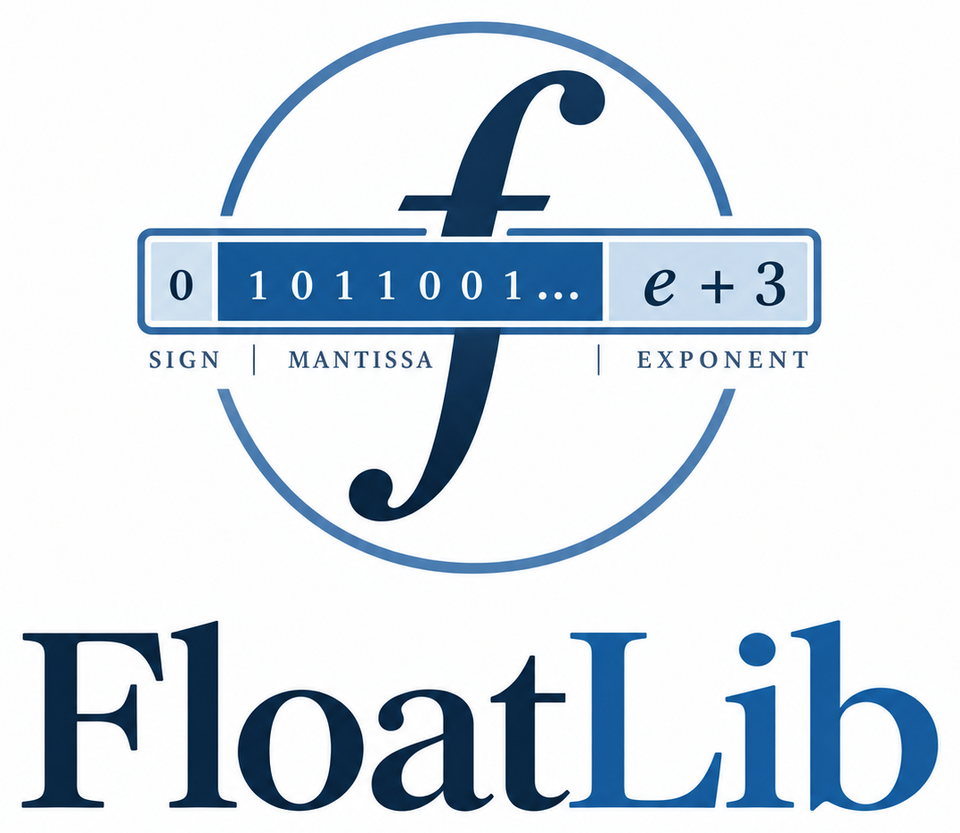

<h1 align="center">
  
  Verified Floating-Point Arithmetic in Lean
</h1>

FloatLib is a Lean library for arbitrary precision floating point arithmetic with
machine-checked proofs.
We built it to bring executable arithmetic and its correctness proofs together. You can
choose a numerical format, write ordinary arithmetic, and use theorems about those same
operations in the rest of your Lean development.

The library covers IEEE binary and decimal, posits with exact quire accumulation, and
small ML formats. If you have a different format in mind, you can define it and build on
the shared integer kernels and rounding theory. We follow the standard literature,
including the details that matter in programs: rounding modes, NaNs, infinities, and
both signed zeros.

In [the guide](site/content/chapters), we work through calculations, proofs, and the
algorithms behind them. The [first chapter](site/content/chapters/01-using-the-library.md)
is a good place to start.

## Installation

From a checkout of this repository, fetch the Mathlib cache and build FloatLib:

```bash
lake exe cache get
lake build
```

Use the Lean version in [lean-toolchain](lean-toolchain); [lake-manifest.json](lake-manifest.json)
already records the dependency versions we use. If you are adding FloatLib to an existing
Lean project, follow the [project setup instructions](site/content/chapters/01-using-the-library.md#setting-up-a-project).

## A calculation and a proof

Here is a small example we can run and reason about. We choose binary32, add two numbers,
and prove that the executable addition returns the specification's result. Save the code
below as `Main.lean` in the repository and run `lake env lean Main.lean`:

```lean
import FloatLib

open FloatLib.Floats

abbrev Binary32 := ExecFloat.Binary (exponentBits := 8) (fractionBits := 23)

#float_info Binary32

def x : Binary32 := 1.5
def y : Binary32 := 2.25

#eval x + y

example : x + y = ExecFloat.Spec.add x y :=
  ExecFloat.Proof.add_eq_spec x y
```

The sum is exactly `3.75`. We used concrete numbers to run the calculation, but
`add_eq_spec` works for arbitrary operands. It identifies the complete result word,
including the encoding of an exceptional value or a signed zero. That gives us an
equation we can use in a larger proof. `#float_info` shows the chosen representation,
backends, and available theorems.

To go from result bits to a bound on rounding error, we also need assumptions about the
format, finiteness, and range. We work through those in the
[guide](site/content/chapters/01-using-the-library.md), along with directed rounding,
exception flags, intervals, and accumulation. You can also start from one of the
[examples](FloatLib/Examples) and adapt it to your own calculation.

## What you can work with

- **IEEE binary and decimal.** Binary arithmetic includes subnormals, signed zeros,
  infinities, NaNs, rounding modes, and status flags. Decimal32, decimal64, and decimal128
  support BID and DPD encodings with arithmetic, conversions, and rounding proofs.
- **Posits and quires.** Choose a total width with `ExecFloat.Posit (bits := n)`.
  `ExecFloat.Posit.Quire (bits := n)` accumulates products exactly within its capacity
  before one final rounding. The library follows the 2022 posit standard.
- **Small and custom formats.** FP8, FP6, FP4, OCP MX blocks, fixed point, logarithmic,
  and codebook representations share the numerical interfaces. The
  [P3109 chapter](site/content/chapters/10-p3109.md) explains the working group's format
  rules and the report this implementation follows.
- **Classical rounding results.** Correct rounding, half-ulp error bounds, and Sterbenz's
  exact-subtraction lemma connect the real-valued theory to executable arithmetic.
  Mixed-precision bounds account for casts, products, and accumulator updates under
  their stated finiteness assumptions.
- **Intervals and affine quantization.** A shared interval API accepts binary, decimal, posit,
  and custom endpoints, with explicit outward-rounding contracts. Affine quantization has
  a real-valued specification with an explicit rounding rule and a proof connecting
  nearest-even quantization to the executable rational implementation.
- **Repeatedly rounded sums.** Reduction trees describe a chosen order of additions.
  Error bounds account for rounding at each node, including absolute-error terms near
  underflow. These are separate from the exact accumulators that round only once.
- **Elementary functions and complex numbers.** Posit elementary functions have proofs
  identifying the correctly rounded real result. Binary elementary functions are
  deterministic approximations, available through the opt-in
  `Configured.Transcendentals` import; general error bounds for those kernels remain
  open. Separate rational `exp` and `log` enclosures have proved containment bounds.
  `ExecComplex` supplies arithmetic on pairs of binary components, with theorems that
  track scalar rounding. The [examples](FloatLib/Examples/Transcendentals.lean) and
  [complex section](site/content/chapters/01-using-the-library.md#complex-arithmetic)
  show how to use them.

We've collected the major theorems in our [theorem index](FloatLib/Floats/THEOREMS.md).
Like other formalization projects, we use [formalization.yaml](formalization.yaml) to
describe the mathematical sources, scope, and key results. It also records how we used
AI during development, alongside the work we did to plan and build the library.

## Speed and independent checks

We have put substantial effort into making the proved arithmetic fast. The
[planner](site/content/chapters/14-backends-and-the-planner.md) chooses among lookup tables,
word kernels, and wider limb algorithms; every certified choice must prove agreement
with the same specification. You can also choose a backend policy yourself. The host-FPU
path is a separate, explicitly unchecked option.

We would like to bring verified arithmetic closer to MPFR's speed. The
[benchmarks](site/content/chapters/15-performance.md) compare scalar operations from 2 to
4,096 bits, so you can see where the kernels do well and where we still have work to do.
Lean checks the proofs before execution and erases them during compilation.
We also ran `leanchecker` to replay the compiled FloatLib declarations through
Lean's kernel.

The saved FloatLib runs matched Berkeley TestFloat on **more than 102 million cases** for the IEEE
formats and operations we checked. Comparisons also cover MPFR, decimal arithmetic,
small-format tables, and posits. SoftPosit differs on a small set of boundary cases;
[the analysis](site/content/chapters/16-external-validation.md#the-softposit-differences)
works through the exact calculations. These comparisons help check the specifications
as well as the implementations.

You can reproduce the external comparisons with the [testing guide](tests/README.md), or
measure your own machine with the [benchmark guide](benchmarks/docs/Comparison.md).

## Source files

If you want to follow an operation into its implementation and proof, these are the
three main parts of the library:

| Directory | What belongs here |
| --- | --- |
| [`FloatLib/Numerics`](FloatLib/Numerics) | Representation-independent meaning, exact arithmetic, contracts, and enclosures |
| [`FloatLib/Kernels`](FloatLib/Kernels) | Shared word and limb algorithms with refinement proofs |
| [`FloatLib/Floats`](FloatLib/Floats) | Concrete formats, real-valued rounding theory, executable operations, and their proofs |

Tests and benchmarks have their own Lake workspaces, keeping them separate from library
imports. The [website](site/) contains the guide, checked Lean examples, references, and
dependency graphs for exploring how the definitions and proofs fit together.

## Contributing

Thanks for your interest in FloatLib! If you have a format you want to add, a kernel
you think could be faster, or a proof that could be simpler, we'd love to hear from you.
We build on Mathlib and follow its proof style and naming conventions. The
[contributing guide](CONTRIBUTING.md) explains how to get started.

For a local check of the library and website:

```bash
bash tests/verify.sh     # build the library and run its checks
bash site/build.sh       # build the guide and check its examples
```

FloatLib is released under the [MIT license](LICENSE).
